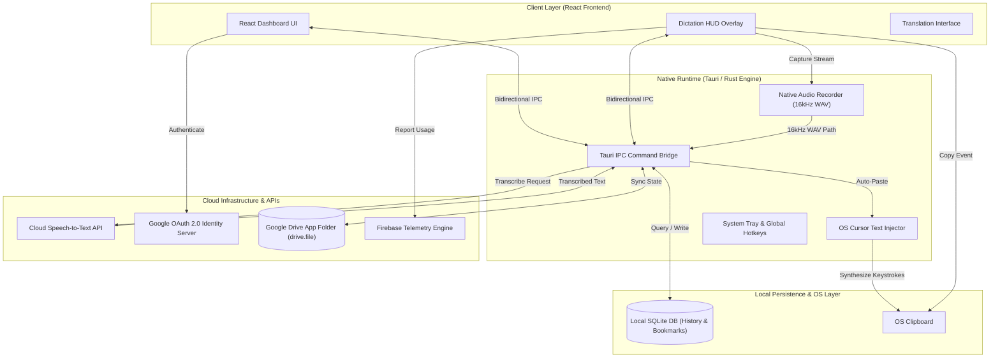

<div align="center">

# Voce

**Secure, offline-first dictation and translation with native Google Drive cloud sync.**

[](https://github.com/Faizulmd13/voce/actions/workflows/release.yml)
[](https://github.com/Faizulmd13/voce/releases/latest)
[](https://github.com/Faizulmd13/voce/releases/latest)
[](https://github.com/Faizulmd13/voce/releases/latest)
<br>
[](https://tauri.app/)
[](https://react.dev/)
[](https://www.rust-lang.org/)
[](LICENSE)

</div>
---

## ⚡ Highlights & Key Features

*   **Offline-First Architecture** — Local translation history, bookmarks, and text data are securely managed via a local SQLite database, allowing full offline usability.
*   **Google Drive Sync** — Seamless cross-device synchronization using an officially verified Google Cloud OAuth production integration (only requests access to app-specific files).
*   **Native Performance** — Built on the lightweight **Tauri** framework, utilizing native OS webviews to minimize RAM usage and executable size.
*   **Instant Copy & Dictation** — Streamlined UI with auto-copy toast notifications and one-click dictation tools.

---

## 📱 Platform Availability

| Platform | Distribution | Requirements |
|----------|--------------|--------------|
| **Windows** | [voce_1.0.1.exe](https://github.com/Faizulmd13/voce/releases/latest) | Windows 10+ |
| **Linux** | [voce_1.0.1.deb](https://github.com/Faizulmd13/voce/releases/latest) | Debian / Ubuntu |
| **macOS** | [voce_1.0.1.app](https://github.com/Faizulmd13/voce/releases/latest) | macOS 10.15+ |

*Note: If Windows SmartScreen blocks the installation of the `.exe`, click **More info** -> **Run anyway**. This is standard for indie-developed binaries pending an enterprise code signing certificate.*

---

## 📚 User Guide

### 1. Installation & Login
Download the latest installer from the [Releases](https://github.com/Faizulmd13/voce/releases) page. Run the installer and sign in with your Google Account to enable cloud backups.

### 2. Dictation & Translation
Speak directly into your microphone or type text to translate. Once transcription is complete, the text is automatically injected to your cursor and copied to your system clipboard for instant use.

### 3. Bookmarks & Offline History
All translations are saved locally via SQLite. You can browse your history or bookmark specific phrases even when disconnected from the internet.

---

## ⚙️ System Architecture

Voce is structured around an offline-first desktop paradigm. A lightweight React UI runs inside Tauri's native webview, interfacing directly with a Rust core process for system APIs, local SQLite storage, and cloud synchronization.



---

## 🛠️ Local Development Setup

Follow these steps to spin up the local development loop:

### 1. Clone the repository
```bash
git clone [https://github.com/Faizulmd13/voce.git](https://github.com/Faizulmd13/voce.git)
cd voce
```

### 2. Install dependencies
Ensure you have Node.js and the Rust toolchain installed on your machine.
```bash
npm install
```

### 3. Start development server
Runs the React frontend and compiles the Tauri Rust backend concurrently with hot-reloading:
```bash
npm run tauri dev
```

### 4. Build for Production
To manually generate the final executable installer:
```bash
npm run tauri build
```
*Note: Automated multi-platform builds are managed via GitHub Actions upon tagging a new release.*